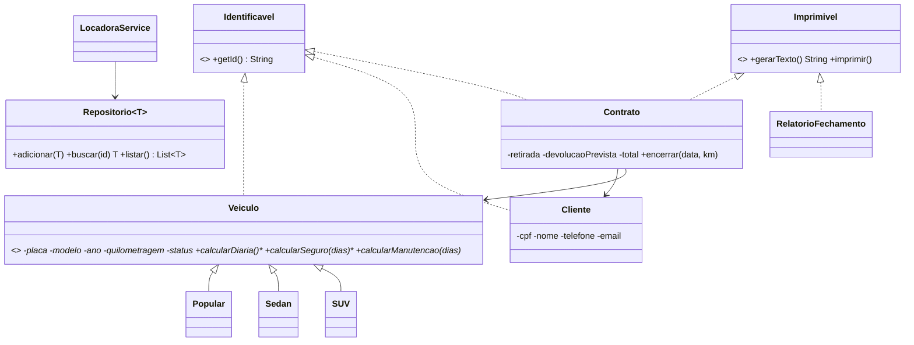

# Rota Segura — Sistema de Locação de Veículos (TP1)

**Aluno:** SEU NOME COMPLETO
**Matrícula:** SUA MATRÍCULA

## Contexto

Projeto baseado no caso clínico "TP1 - T1" (Técnicas de Programação I): a locadora "Rota Segura" precisa centralizar o ciclo de vida da locação, do cadastro do veículo ao relatório de fechamento, com frota diversa (Popular, Sedan, SUV), dados protegidos, validação de disponibilidade em tempo real, relatórios polimórficos, tratamento de exceções e histórico completo de locações.

## Arquitetura

Aplicação de console em Java 17+, organizada em pacotes:

| Pacote | Responsabilidade |
|---|---|
| `modelo` | `Veiculo` (abstrata) e `Popular`/`Sedan`/`SUV`; `Cliente`; `Contrato`; `StatusVeiculo`; `Identificavel` |
| `excecao` | `RotaSeguraException` e especializações (dados inválidos, data inválida, veículo indisponível, não encontrado) |
| `repositorio` | `Repositorio<T extends Identificavel>` genérico |
| `relatorio` | `Imprimivel` (interface padrão) e `RelatorioFechamento` |
| `persistencia` | `BancoDeDados` + `ArquivoPersistencia` (serialização binária e comprovantes `.txt`) |
| `servico` | `LocadoraService` (regras de negócio) |
| `app` | `Main` (menu de console e demonstração) |

### Diagrama de classes



### Onde está cada conceito

- **Encapsulamento:** atributos `private` em `Veiculo` e `Cliente`; setters validam (placa, ano, km, CPF, e-mail, telefone).
- **Herança/Abstração:** `Veiculo` abstrata → `Popular`, `Sedan`, `SUV`.
- **Polimorfismo:** `calcularDiaria/Seguro/Manutencao` sobrescritos por categoria; `Contrato` e `RelatorioFechamento` implementam `Imprimivel`.
- **Generics:** `Repositorio<T extends Identificavel>` usado para veículos, clientes e contratos; `imprimirLista(List<T>)` em `Main`.
- **Exceções:** hierarquia própria (checked) + tratamento no `Main.executar`.
- **Persistência:** `dados/rotasegura.dat` (binário) e `dados/comprovantes/*.txt`.

### Regras de preço

| Categoria | Diária | Seguro (sobre diárias) | Manutenção/dia |
|---|---|---|---|
| Popular | R$ 90 | 5% | R$ 5 |
| Sedan | R$ 150 | 8% | R$ 10 |
| SUV | R$ 250 | 12% | R$ 20 |

Atraso: multa de 20% da diária por dia excedente.

## Como compilar e executar

Requer JDK 17 ou superior.

```bash
# Linux/macOS
mkdir -p out
javac -encoding UTF-8 -d out $(find src -name "*.java")
java -cp out br.rotasegura.app.Main
```

```powershell
# Windows (PowerShell)
mkdir out -Force
javac -encoding UTF-8 -d out (Get-ChildItem -Recurse src -Filter *.java).FullName
java -cp out br.rotasegura.app.Main
```

## Cenários de teste

| # | Cenário | Resultado esperado |
|---|---|---|
| 1 | Cadastrar veículo com placa `123` | `DadosInvalidosException` |
| 2 | Cadastrar cliente com CPF `111.111.111-11` | `DadosInvalidosException` |
| 3 | Abrir locação com devolução antes da retirada | `DataInvalidaException` |
| 4 | Abrir locação válida | Contrato `C0001` gerado e salvo |
| 5 | Alugar o mesmo veículo de novo | `VeiculoIndisponivelException` |
| 6 | Devolver com data anterior à retirada | `DataInvalidaException` |
| 7 | Devolver com atraso | Total com diárias + seguro + manutenção + multa |
| 8 | Listar veículos disponíveis (opção 10) após uma locação aberta | O veículo locado não aparece |
| 9 | Histórico por cliente / por veículo (opções 11 e 12) | Lista contratos abertos e encerrados |
| 10 | Fechar e reabrir o programa | Dados continuam listados (persistência) |

A opção **9** do menu executa todos esses cenários automaticamente.
